<h1> Kuafor_Otomasyonu <h1>

<h2> Amaç ve Kapsam: <h2>

<h6> Bu proje, bir kuaför salonunun online varlığını güçlendirmek ve müşteri deneyimini artırmak amacıyla tasarlanmış bir web sitesini içermektedir. Temel gayemiz, müşterilere hızlı ve kullanıcı dostu bir platform sunarak kuaför salonumuzun hizmetlerine erişimlerini kolaylaştırmak ve randevu sürecini optimize etmektir. <h6>
    <section>
        <h2>Amaçlar</h2>
        <ol>
            <li>Randevu Yönetimi: Müşterilerin online olarak randevu alabilmesini sağlayacak bir rezervasyon sistemi oluşturmak.</li>
            <li>Hizmet Bilgisi: Kuaför salonumuzun sunduğu hizmetlerin detaylı bir şekilde tanıtılması ve görsellerle desteklenmesi.</li>
            <li>Personel Takibi: Çalışan kuaförlerimizin programlarını güncellemek ve müşterilerin tercih ettiği kuaförleri seçmelerine olanak sağlamak.</li>
        </ol>
    </section>
 <section>
        <h2>Kapsam</h2>
        <ul>
            <li>Müşteri Girişi: Müşteriler, kişisel hesaplarına giriş yaparak randevu oluşturabilir</li>
            <li>Personel Girişi: Kuaför salonu personeli, müşteri randevularını görebilir ve randevuya onay veya ret verir</li>
            <li>İletişim Formu: Müşterilerin sorularını iletebilecekleri bir iletişim formu oluşturulacak.</li>
        </ul>
    </section>
<h3> Genel Bakış: <h3>

<h6> Kuaför Web otomasyonumuz müşteri ve kuaför arasındaki her türlü işlemi yapabilecek, verileri saklayabilecek son derece basit ve sade bir kullanıma sahip web destekli bir uygulamadır. <h6>  
  <h4> Anasayfa Ekranı: <h4>
<h6> Anasayfada randevular, iletisim, hakkımızda, giris ve hesap ac sayfalarına erişim sağlanır. <h6>

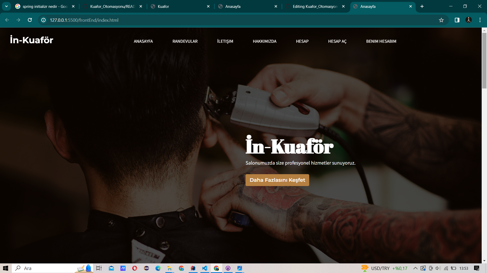 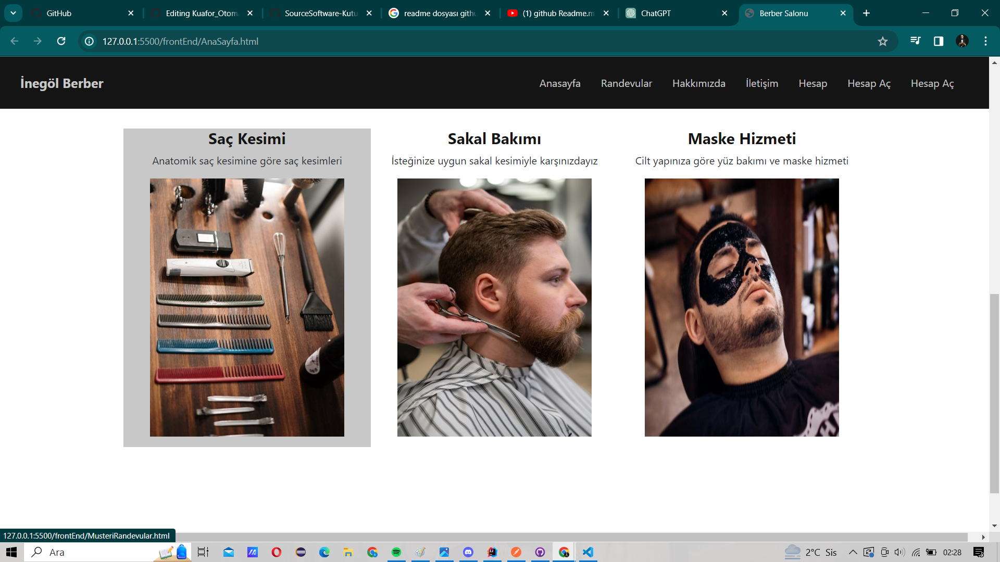
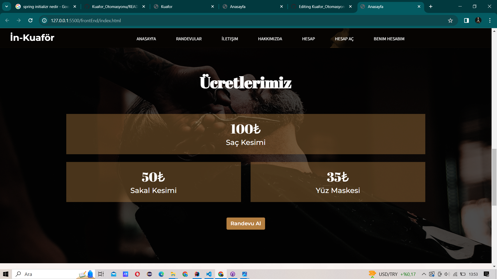 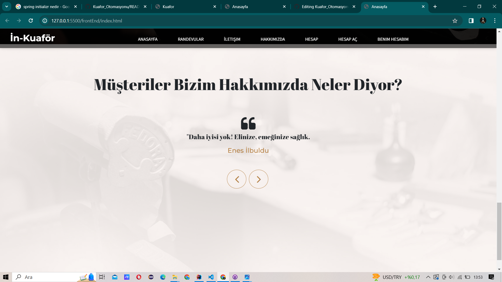

<h4> Hakkımızda Sayfası: <h4>

<h6> Firmamız hakkında bilgilendirme yaptıgımız sayfamız <h6>
  
  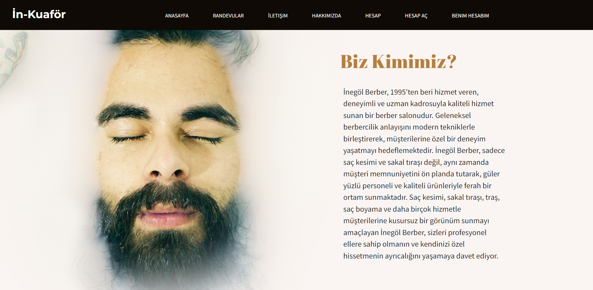
<h4> İletisim sayfamız: <h4>

<h6> Bu sayfamızda iletisim bilgilerimiz ile bize ulasın kısmımız vardır bize ulasını kullanabilmeniz için üye olmanıza gerekmez<h6>
  
  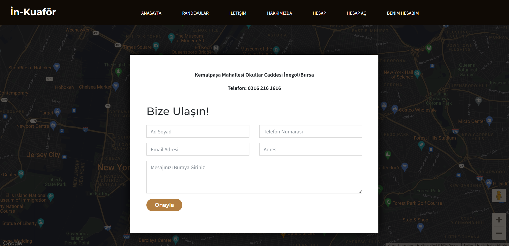
<h4> İletisim sayfamız: <h4>

<h6> Bu sayfamızda iletisim bilgilerimiz ile bize ulasın kısmımız vardır bize ulasını kullanabilmeniz için üye olmanıza gerekmez<h6>
  <h4> Müşteri kayıt sayfamız <h4>

<h6> müsteriler sisteme kayıt oldugu kısımdır<h6>
  
  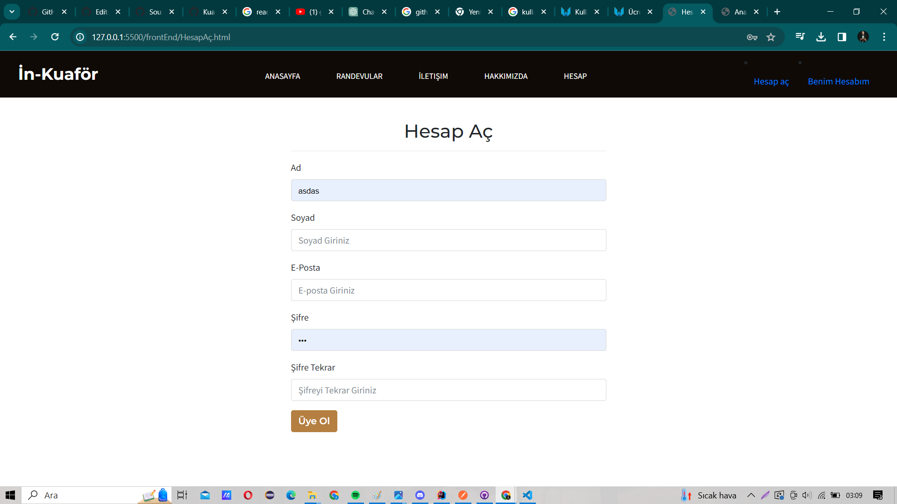
   
<h4> Giriş sayfamız: <h4>

<h6> Bu sayfamızda üye bilgilerimizi gireriz eger admin sek admin e atar,müşteriysek müsteri sayfamıza,eger kuaförsek kuaför sayfamıza<h6>
  
  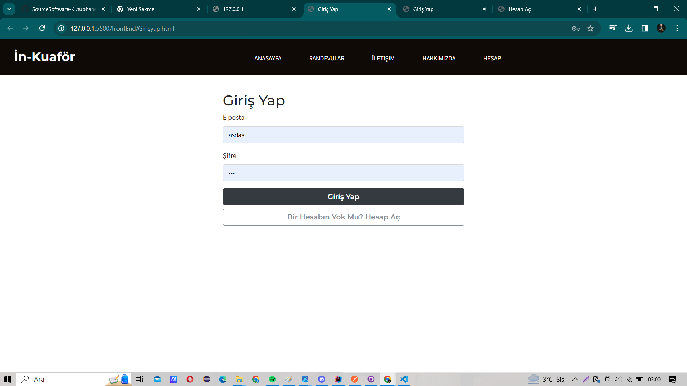
  <h4> Admin sayfamız <h4>

<h6> Burada kuaför, müşterinin ve bize ulasının bilgilerini tutarız.Kuaför ve müsteri ekleme yaparız,kuaför güncelleme yaparız<h6>
  
  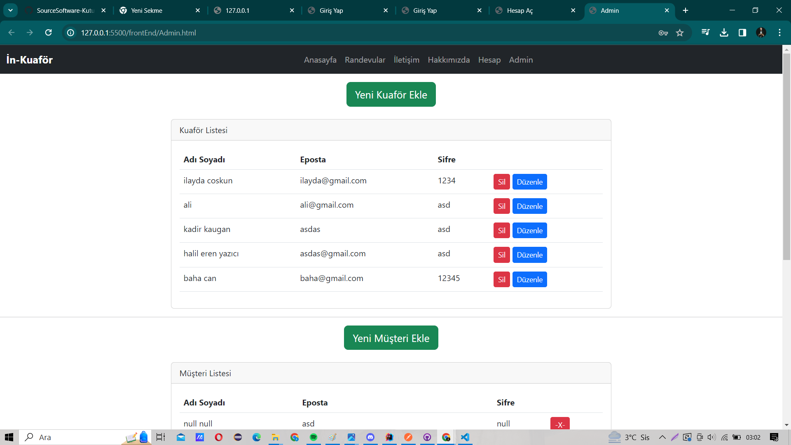
    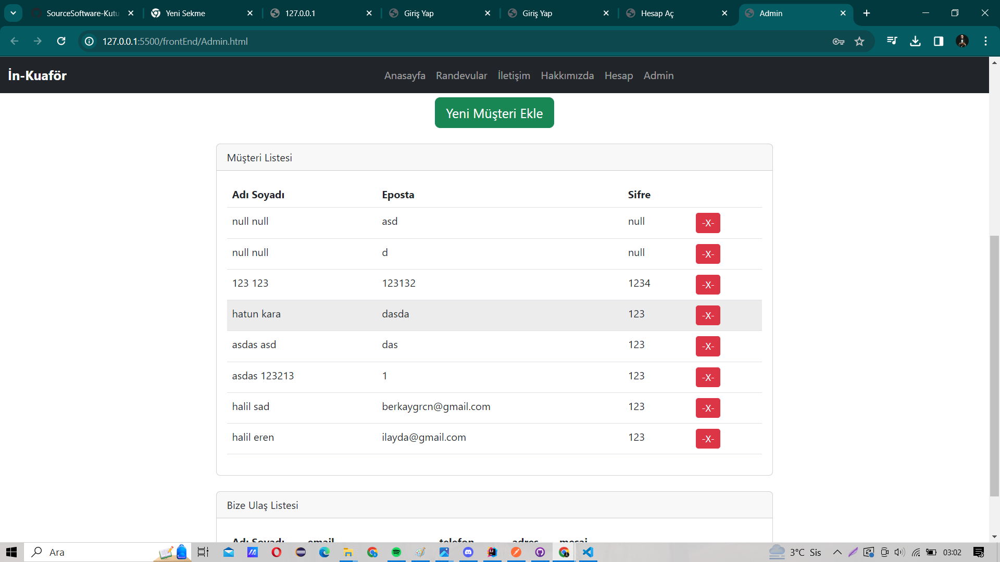
  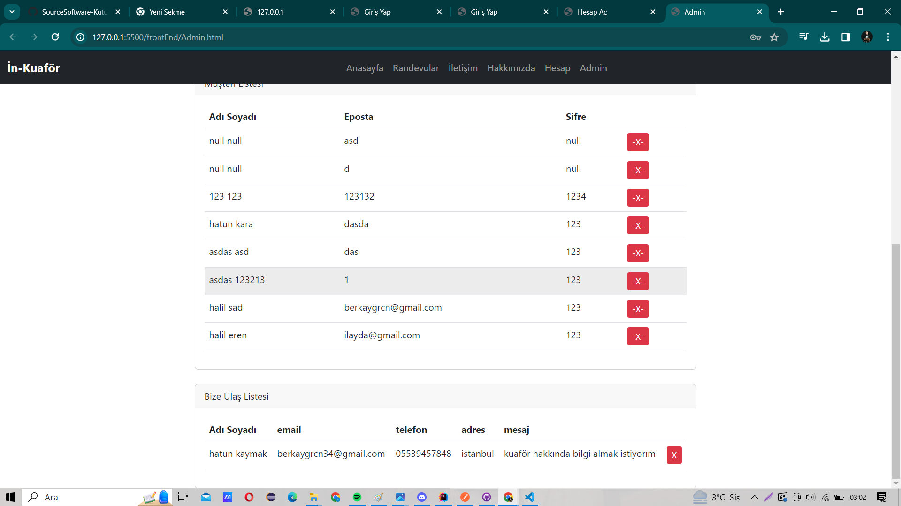
  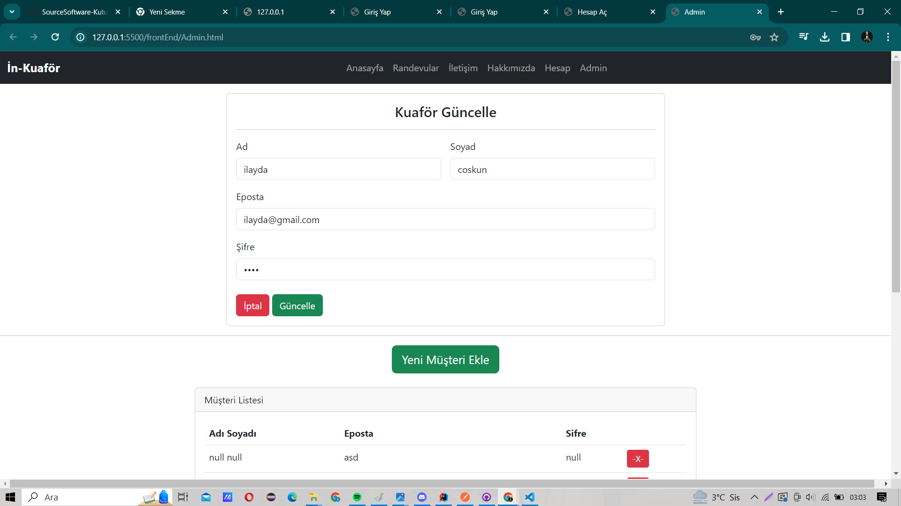
  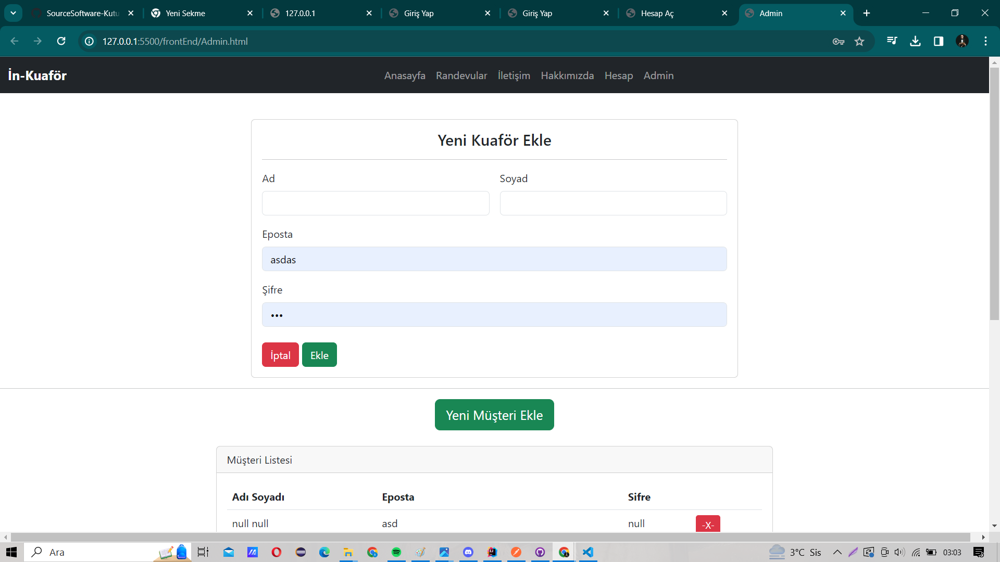
  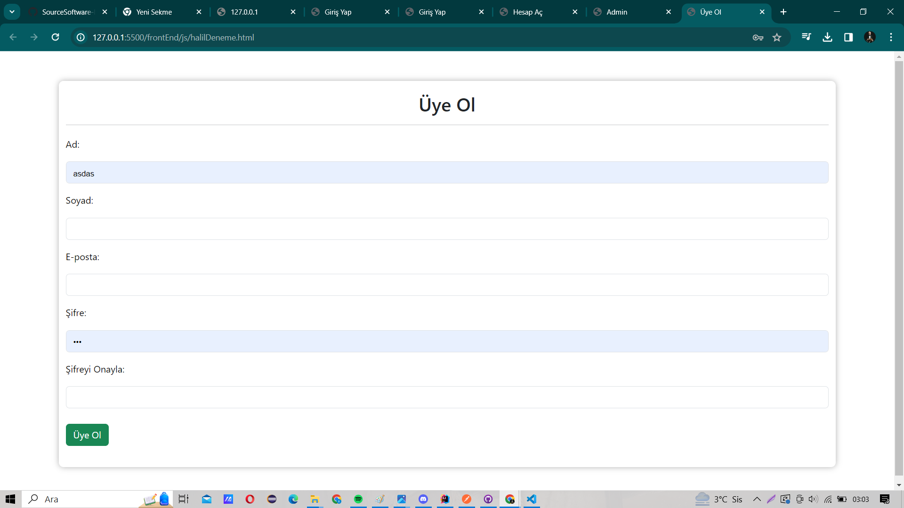

 
  <h4> Kuaför sayfamız <h4>

<h6> Burada kuaför, randevuları siler ve günceller<h6>
  
  
 <h4> Burası randevu sayfamızdır <h4>

<h6> Randevu aldıgımız sayfadır hangi gün hangi saatte onu seceriz<h6>
  
  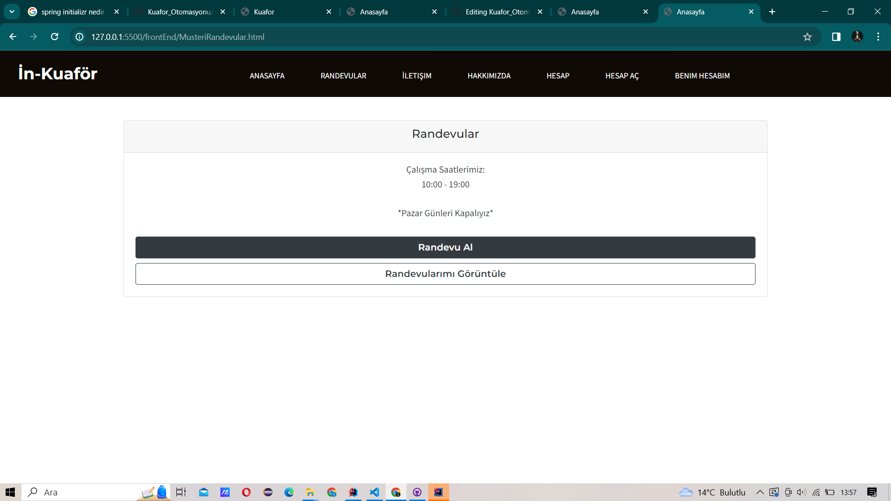  
    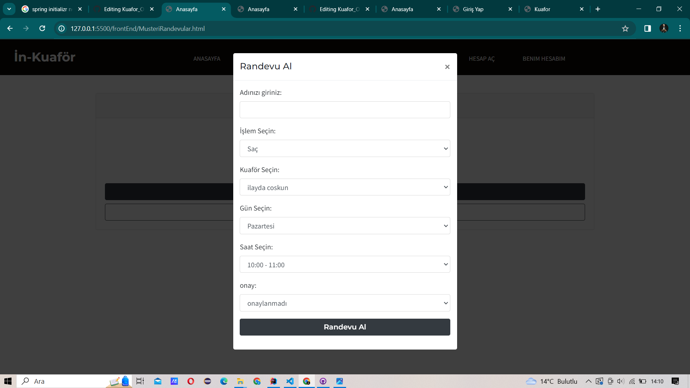  

  <h4> Hesabım sayfamız <h4>

<h6> Burada müşteri giris yaptıktan sonra görücegi kısım kendi bilgileri ve randevu bilgilerini görür<h6>
  
  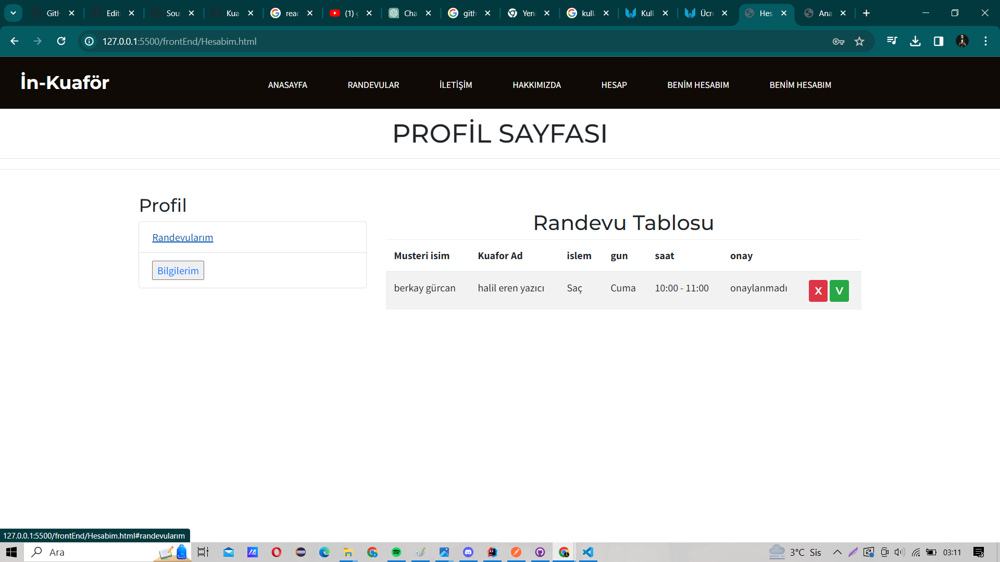 
    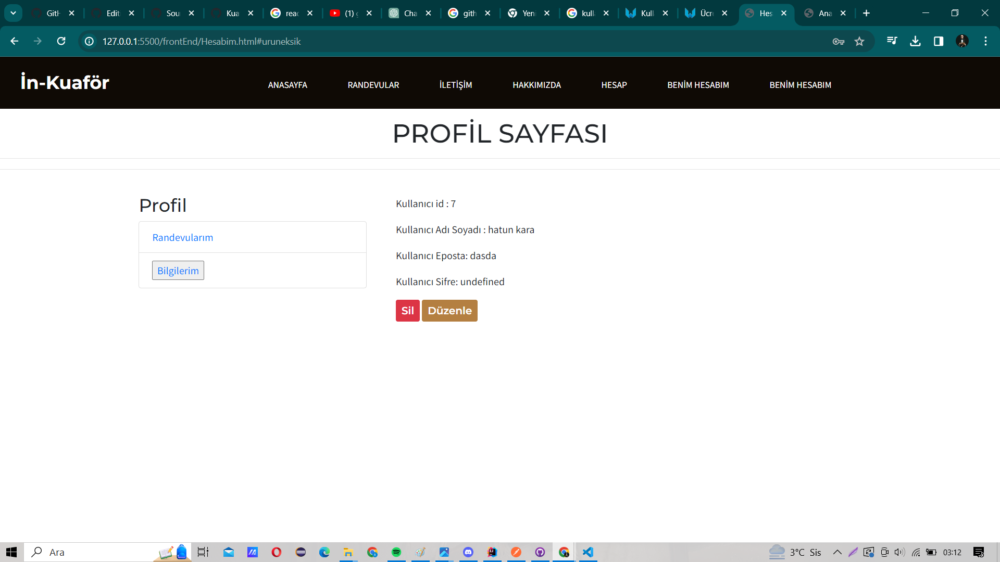 

  <h2>Ekip Üyeleri</h2>
  <h4>Berkay Gürcan 132030022</h4>
  <h4>Halil Eren Yazıcı 132030049</h4>
<h4>Kadir Korkmaz 132030046</h4>
<h4>Baha Can 131830066</h4>
