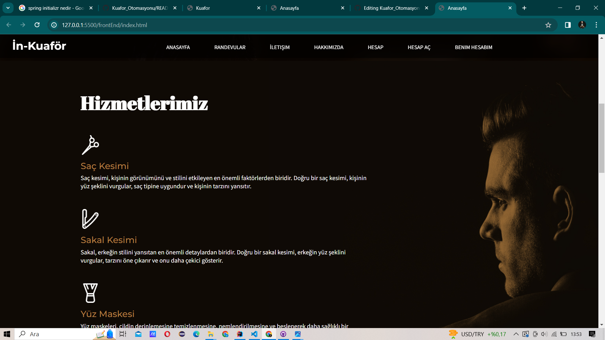
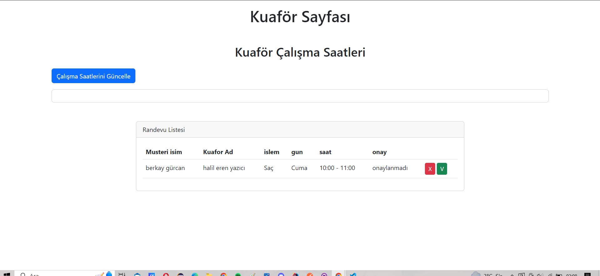

# Kuafor_Otomasyonu

## Amaç ve Kapsam:

Bu proje, bir kuaför salonunun online varlığını güçlendirmek ve müşteri deneyimini artırmak amacıyla tasarlanmış bir web sitesini içermektedir. Temel gayemiz, müşterilere hızlı ve kullanıcı dostu bir platform sunarak kuaför salonumuzun hizmetlerine erişimlerini kolaylaştırmak ve randevu sürecini optimize etmektir.

### Amaçlar:

1. **Randevu Yönetimi:** Müşterilerin online olarak randevu alabilmesini sağlayacak bir rezervasyon sistemi oluşturmak.
2. **Hizmet Bilgisi:** Kuaför salonumuzun sunduğu hizmetlerin detaylı bir şekilde tanıtılması ve görsellerle desteklenmesi.
3. **Personel Takibi:** Çalışan kuaförlerimizin programlarını güncellemek ve müşterilerin tercih ettiği kuaförleri seçmelerine olanak sağlamak.

### Kapsam:

- **Müşteri Girişi:** Müşteriler, kişisel hesaplarına giriş yaparak randevu oluşturabilir.
- **Personel Girişi:** Kuaför salonu personeli, müşteri randevularını görebilir ve randevuya onay veya ret verebilir.
- **İletişim Formu:** Müşterilerin sorularını iletebilecekleri bir iletişim formu oluşturulacak.

## Genel Bakış:

Kuaför Web otomasyonumuz müşteri ve kuaför arasındaki her türlü işlemi yapabilecek, verileri saklayabilecek son derece basit ve sade bir kullanıma sahip web destekli bir uygulamadır.

### Anasayfa Ekranı:

Anasayfada randevular, iletişim, hakkımızda, giriş ve hesap açma sayfalarına erişim sağlanır.

 
 

### Hakkımızda Sayfası:

Firmamız hakkında bilgilendirme yaptığımız sayfamız.

### İletişim Sayfası:

Bu sayfada iletişim bilgilerimizle bize ulaşın kısmımız vardır ve bize ulaşmak için üye olmanıza gerek yoktur.

### Müşteri Kayıt Sayfası:

Müşterilerin sisteme kayıt olduğu kısımdır.

### Giriş Sayfası:

Bu sayfada üye bilgilerimizi gireriz. Eğer adminsek admin sayfasına yönlendirilir, müşteriysek müşteri sayfasına, kuaförsek kuaför sayfasına.

### Admin Sayfası:

Kuaför, müşteri ve ulaşım bilgilerini tutarız. Kuaför ve müşteri ekleme, güncelleme yaparız.

### Kuaför Sayfası:

Bu sayfada kuaför randevularını silebilir ve güncelleyebilir.

### Randevu Sayfası:

Randevu alındığı sayfadır. Hangi gün ve saatte randevu alınacağını seçeriz.

### Hesabım Sayfası:

Bu sayfada müşteri giriş yaptıktan sonra göreceği kısım kendi bilgileri ve randevu bilgilerini görür.

Diagram

## Ekip Üyeleri:

- Berkay Gürcan 132030022
- Halil Eren Yazıcı 132030049
- Kadir Korkmaz 132030046
- Baha Can 131830066
